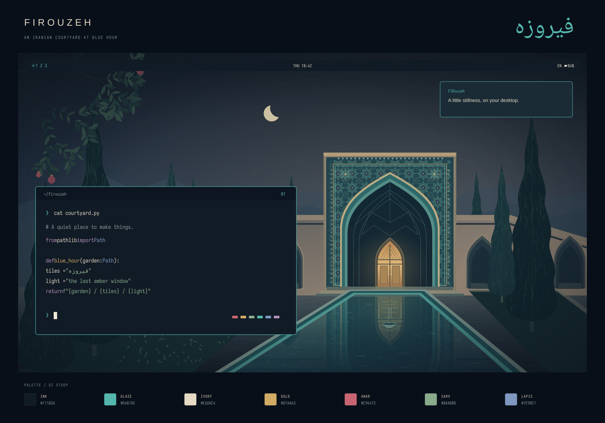

# Firouzeh — فیروزه

An Iranian courtyard at blue hour. Glazed turquoise, midnight ink, warm ivory,
aged gold, pomegranate and cypress. **Firouzeh** is Persian for turquoise.



## Design

The illustrated courtyard draws from Iranian garden and courtyard architecture:
a tiled iwan, an amber-lit wooden doorway, a reflecting **حوض**, tall cypresses
and a pomegranate branch. The companion wallpaper places an eight-pointed star
medallion along the right edge of an otherwise quiet midnight-blue desktop.

Both wallpapers are original, reproducible vector illustrations, exported at
**3840 × 2160**. The preview above is a palette/UI study; application layout,
font sizes and transparency follow your desktop settings.

The relationship between artwork and interface was inspired by
[Akane](https://github.com/Grenish/omarchy-akane-theme). Firouzeh's illustrations
and palette were created for this theme.

## Use

Requires **Omarchy 4 (Quattro)** or newer. From the dotfiles repository root,
link the theme once:

```sh
mkdir -p "$HOME/.config/omarchy/themes"
ln -s "$PWD/omarchy/themes/firouzeh" "$HOME/.config/omarchy/themes/firouzeh"
omarchy theme set firouzeh
```

The full dotfiles installer also links the theme and accepts it as a selection:

```sh
./omarchy/install.sh firouzeh
```

After installation, select it with `omarchy theme set firouzeh`, or use the
Omarchy theme picker. Cycle between the courtyard and tilework with:

```sh
omarchy theme bg next
```

The repository's Neovim configuration follows the generated Aether palette.
Run `:OmarchyTheme` to sync an already-open Neovim instance.

## Palette

| Role | Color | Inspiration |
| --- | --- | --- |
| Background | `#111B26` | Midnight ink |
| Raised surface | `#1B2B36` | Blue courtyard shadows |
| Accent / cyan | `#54B7AE` | Glazed turquoise |
| Foreground | `#E6DAC4` | Warm ivory |
| Yellow | `#D1AA63` | Aged gold and lamplight |
| Red | `#C96472` | Pomegranate — anar |
| Green | `#8AAB8B` | Cypress — sarv |
| Blue | `#7E98C1` | Dusty lapis |
| Magenta | `#B58EBA` | Evening mauve |
| Muted text | `#83999B` | Weathered blue-gray stone |

`colors.toml` is the shared UI palette, including all normal and bright ANSI
colors, explicit selections and Hyprland border colors. Omarchy generates the
terminal, editor, bar, btop, browser and other supported app configurations.
The generated `shell.*.toml` section overrides give menus, the launcher and
notifications raised surfaces; the native lock screen gets matching input,
selection and error colors over the active wallpaper.

## Artwork and rebuilding

| File | Purpose |
| --- | --- |
| `backgrounds/01-blue-hour-courtyard.png` | Main illustrated wallpaper, 4K |
| `backgrounds/02-midnight-tilework.png` | Quiet geometric wallpaper, 4K |
| `artwork/*.svg` | Editable vector exports and Persian wordmark |
| `preview.png` | Palette and UI study |
| `build.py` | Deterministic artwork and shell-color generator |

Rebuild after editing `colors.toml` or the artwork generator:

```sh
python3 omarchy/themes/firouzeh/build.py
omarchy theme set firouzeh
```

The builder needs Python 3.11+ and `rsvg-convert` from `librsvg`. Noto Naskh
Arabic supplies the properly shaped Persian wordmark; CaskaydiaMono Nerd Font
is used in the UI study. The wallpapers themselves contain no text. The
included PNGs are ready to use without running the builder or installing fonts.

Randomized foliage, stars and water ripples use fixed seeds. The four
`shell.*.toml` files are regenerated from the shared palette by the same build.
