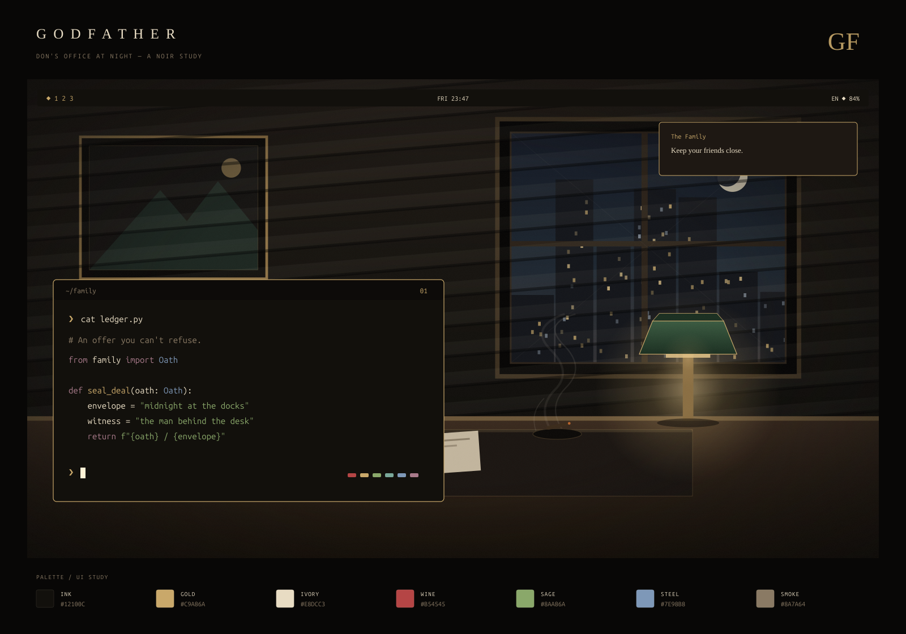

# Godfather — The Family

A dark noir Omarchy theme: warm black ink, aged gold, wine red, ivory
paper, sage and dusty steel. Inspired by classic mob-cinema — a don's
office at night with venetian-blind light, a banker's lamp, whiskey,
a rose, cigar smoke, and a city skyline outside.



## Design

The palette is built around warm near-blacks (`#12100C`, `#0D0B09`)
with umber surfaces (`#1E1813`). The accent is aged gold (`#C9A86A`) —
the dull sheen of a signet ring, not bright yellow. Foreground is warm
ivory (`#E8DCC3`) so it reads softly against the dark, and the ANSI
colors are lifted for terminal readability: wine red, sage green,
dusty steel blue, muted rose.

Both wallpapers are original, reproducible vector illustrations,
exported at **3840 × 2160**. The preview above is a palette/UI study;
application layout, font sizes and transparency follow your desktop
settings.

The relationship between artwork and interface was inspired by
[Akane](https://github.com/Grenish/omarchy-akane-theme). Godfather's
illustrations and palette were created for this theme.

## Use

Requires **Omarchy 4 (Quattro)** or newer. From the dotfiles repository root,
link the theme once:

```sh
mkdir -p "$HOME/.config/omarchy/themes"
ln -s "$PWD/omarchy/themes/godfather" "$HOME/.config/omarchy/themes/godfather"
omarchy theme set godfather
```

The full dotfiles installer also links the theme and accepts it as a selection:

```sh
./omarchy/install.sh godfather
```

After installation, select it with `omarchy theme set godfather`, or use the
Omarchy theme picker. Cycle between the office and the crest with:

```sh
omarchy theme bg next
```

The repository's Neovim configuration follows the generated Aether palette.
Run `:OmarchyTheme` to sync an already-open Neovim instance.

## Palette

| Role | Color | Inspiration |
| --- | --- | --- |
| Background | `#12100C` | Warm black ink |
| Raised surface | `#1E1813` | Dark umber wood |
| Accent / gold | `#C9A86A` | Aged-gold signet |
| Foreground | `#E8DCC3` | Warm ivory paper |
| Red | `#B54545` | Wine — vino |
| Green | `#8AA86A` | Sage / olive |
| Blue | `#7E98B8` | Dusty steel |
| Magenta | `#A87A8A` | Muted rose |
| Muted text | `#8A7A64` | Cigar smoke |

`colors.toml` is the shared UI palette, including all normal and bright ANSI
colors, explicit selections and Hyprland border colors. Omarchy generates the
terminal, editor, bar, btop, browser and other supported app configurations.
The generated `shell.*.toml` section overrides give menus, the launcher and
notifications raised umber surfaces; the native lock screen gets matching input,
selection and error colors over the active wallpaper.

## Artwork and rebuilding

| File | Purpose |
| --- | --- |
| `backgrounds/01-don-office.png` | Main illustrated wallpaper, 4K |
| `backgrounds/02-family-crest.png` | Quiet geometric wallpaper, 4K |
| `artwork/*.svg` | Editable vector sources and wordmark |
| `preview.png` | Palette and UI study |
| `build.py` | Deterministic artwork and shell-color generator |

Rebuild after editing `colors.toml` or the artwork generator:

```sh
python3 omarchy/themes/godfather/build.py
omarchy theme set godfather
```

The builder needs Python 3.11+ and `rsvg-convert` from `librsvg`. The
wallpapers themselves contain no text. The included PNGs are ready to use
without running the builder or installing fonts.

Randomized city windows use fixed seeds. The six `shell.*.toml` files are
regenerated from the shared palette by the same build.
